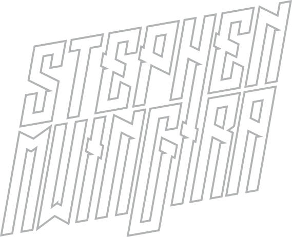

# ✌️ Stephen Mwingira

  **_`#CertifiedPorkchop`_**  

Hey, I'm Stephen, and I'm a software engineer and content creator from the Garden State, welcome to my GitHub page. I have professional experience creating modern, performance focused, and responsive applications using a myriad of tools and languages. You can keep up with me, my work, and content produced and maintained outside of GitHub by visiting any of the following links below.

[![Portfolio](https://img.shields.io/badge/Portfolio-black.svg?logo=data:image/svg%2bxml;base64,PHN2ZyB4bWxucz0iaHR0cDovL3d3dy53My5vcmcvMjAwMC9zdmciIHZpZXdCb3g9IjAgMCAxNzkuNDIgMjQ5LjE5Ij48ZGVmcz48c3R5bGU+LmNscy0xe2ZpbGw6I2ZmZjt9PC9zdHlsZT48L2RlZnM+PGcgaWQ9IkxheWVyXzIiIGRhdGEtbmFtZT0iTGF5ZXIgMiI+PGcgaWQ9IkxheWVyXzEtMiIgZGF0YS1uYW1lPSJMYXllciAxIj48cG9seWdvbiBjbGFzcz0iY2xzLTEiIHBvaW50cz0iMTQ4LjI3IDI0Ny43NiAxNzkuNDIgMjQ5LjE5IDE2NS4wOCAyMjEuNTEgMTM2LjQyIDE2Ni4xMyAxMjIuMDkgMTM4LjQ0IDkwLjk1IDEzNy4wMSA1OS44MSAxMzUuNTcgNDUuNDcgMTA3Ljg5IDMxLjE0IDgwLjIgNDcuOTYgNTMuOTQgNjIuMjkgODEuNjMgNzYuNjIgMTA5LjMyIDEwNy43NiAxMTAuNzUgOTMuNDMgODMuMDcgNzkuMSA1NS4zOCA2NC43NyAyNy42OSA1MC40NCAwIDAgNzguNzYgMTQuMzMgMTA2LjQ1IDI4LjY1IDEzNC4xNCAyOC42NiAxMzQuMTQgNDIuOTkgMTYxLjgyIDQyLjk5IDE2MS44MiA3NC4xNCAxNjMuMjYgMTA1LjI4IDE2NC43IDExOS42MSAxOTIuMzggMTE5LjYxIDE5Mi4zOSAxMzMuOTQgMjIwLjA3IDEzMy45NCAyMjAuMDcgMTAyLjggMjE4LjYzIDg4LjQ4IDE5MC45NSA4OC40NyAxOTAuOTQgODguNDYgMTkwLjk1IDU3LjMyIDE4OS41MiA3MS42NSAyMTcuMiA4NS45OCAyNDQuODkgMTE3LjEzIDI0Ni4zMiAxNDguMjcgMjQ3Ljc2Ii8+PC9nPjwvZz48L3N2Zz4=)](https://stephenwm.me/)

### 🧰 Skills and Tools

![Playwright](https://img.shields.io/badge/Playwright-black.svg?logo=data:image/svg%2bxml;base64,PHN2ZyB3aWR0aD0iMjU2IiBoZWlnaHQ9IjE5MS44MyIgdmlld0JveD0iMCAwIDI1NiAxOTEuODMiIHhtbG5zPSJodHRwOi8vd3d3LnczLm9yZy8yMDAwL3N2ZyIgeG1sbnM6eGxpbms9Imh0dHA6Ly93d3cudzMub3JnLzE5OTkveGxpbmsiIHByZXNlcnZlQXNwZWN0UmF0aW89InhNaWRZTWlkIj48dGl0bGU+UGxheXdyaWdodDwvdGl0bGU+PGc+PHBhdGggZD0iTTg0LjM4MDI1OCwxMDguMzUxNjA4IEM3NC44MjM4NDk1LDExMS4wNjM2ODIgNjguNTU0MjY0LDExNS44MTg4OTcgNjQuNDI0MjI4NCwxMjAuNTcwNDAzIEM2OC4zNzk5ODUzLDExNy4xMDg1NTkgNzMuNjc4ODAxLDExMy45MzE0OTUgODAuODI2NDU0NywxMTEuOTA1NDExIEM4OC4xMzcyNjI5LDEwOS44MzMzNDggOTQuMzc0MjE3NCwxMDkuODQ4MTgxIDk5LjUyNzY3NzIsMTEwLjg0MjY4MiBMOTkuNTI3Njc3MiwxMDYuODEyNzY0IEM5NS4xMzE0MDMsMTA2LjQxMDgxIDkwLjA5MTQwOTgsMTA2LjczMTE4NyA4NC4zODAyNTgsMTA4LjM1MTYwOCBaIE02My45ODc0MTkxLDc0LjQ3NDc4NTEgTDI4LjQ5NjQ3ODIsODMuODI1MDI1NiBDMjguNDk2NDc4Miw4My44MjUwMjU2IDI5LjE0MzMxMTksODQuNzM4NjkxMiAzMC4zNDEwMTQ4LDg1Ljk1NzkwMDkgTDYwLjQzMjg3NDIsNzguMDI4NTg4NCBDNjAuNDMyODc0Miw3OC4wMjg1ODg0IDYwLjAwNjQ0NzQsODMuNTIzMTg5NiA1Ni4zMDMzNTc3LDg4LjQzODU5MjEgQzYzLjMwODEwMjgsODMuMTM5MDM0OCA2My45ODc0MTkxLDc0LjQ3NDc4NTEgNjMuOTg3NDE5MSw3NC40NzQ3ODUxIFogTTkzLjY5NTY0MjcsMTU3Ljg4NDU5NiBDNDMuNzUwNDY3LDE3MS4zMzY2OTEgMTcuMzI2MTAwMSwxMTMuNDU1MzggOS4zMjU4ODk1NCw4My40MTI2ODk1IEM1LjYyOTY5Njc2LDY5LjU0NTI5MjEgNC4wMTYxNzIxNiw1OS4wNDI1ODcgMy41ODYxMTE1Miw1Mi4yNjQ5OTc1IEMzLjUzOTkwOTExLDUxLjU2MTIwOCAzLjU2MTI2NzUzLDUwLjk2NzkxODYgMy42MTEwMjk2OCw1MC40MjQzMTczIEMxLjAyMDEzNSw1MC41ODA3OTczIC0wLjIyMDI4NDc1NCw1MS45Mjc1NjQyIDAuMDMyMDg1NzExNyw1NS44MTk1NDI1IEMwLjQ2MjE0NjM0NCw2Mi41OTM0MjM5IDIuMDc1NjcwOTUsNzMuMDk1Mzg3MyA1Ljc3MTg2MzczLDg2Ljk2NzIzNDQgQzEzLjc2ODUxNDUsMTE3LjAwNTQ3NSA0MC4xOTY0NDEyLDE3NC44ODY3ODYgOTAuMTQxODM5NCwxNjEuNDM0NjkxIEMxMDEuMDEzMTI1LDE1OC41MDYwNjcgMTA5LjE4MDQ5NSwxNTMuMTcxNjU0IDExNS4zMTEzOTksMTQ2LjM2MjE3NSBDMTA5LjY2MDMxOCwxNTEuNDY1OTQ3IDEwMi41ODc1NjcsMTU1LjQ4NTQ4MiA5My42OTU2NDI3LDE1Ny44ODQ1OTYgWiBNMTAzLjA4MTQ4MSwzOS4wNTA5NiBMMTAzLjA4MTQ4MSw0Mi42MDU1MDUgTDEyMi42NzE4OTYsNDIuNjA1NTA1IEMxMjIuMjY5OTQyLDQxLjM0Njk4OTkgMTIxLjg2NTAyMiw0MC4yMTMwNjU2IDEyMS40NjMwNjgsMzkuMDUwOTYgTDEwMy4wODE0ODEsMzkuMDUwOTYgWiIgZmlsbD0iIzJENDU1MiIvPjxwYXRoIGQ9Ik0xMjcuMDUwMzcxLDY4LjMyNTM0MDggQzEzNS44NjA3MTgsNzAuODI3NTM4NyAxNDAuNTIwMjY1LDc3LjAwNDQyMjcgMTQyLjk4MzE1Nyw4Mi40NzA4NDI2IEwxNTIuODA2NTQ2LDg1LjI2MDc4NTkgQzE1Mi44MDY1NDYsODUuMjYwNzg1OSAxNTEuNDY2NDU0LDY2LjEyOTQyODUgMTM0LjE2MTY4Niw2MS4yMTQwMjYxIEMxMTcuOTczMDQ0LDU2LjYxNDU1MDIgMTA4LjAxMDk3NCw3MC4yMDkwMzQ1IDEwNi43OTkxOCw3MS45NjgxMzc1IEMxMTEuNTA4NDE0LDY4LjYxMzA4NjEgMTE4LjM4NTM4LDY1Ljg2NjE1NjMgMTI3LjA1MDM3MSw2OC4zMjUzNDA4IFogTTIwNS4yNDY2NTIsODIuNTU5MDk0NCBDMTg5LjA0MzE3Nyw3Ny45Mzg4NTM0IDE3OS4wODQ4MTUsOTEuNTYxNTE5IDE3Ny44OTA4MjEsOTMuMjk2MTQ4OCBDMTgyLjYwMzc2Myw4OS45NDQ4MDU0IDE4OS40NzcwMiw4Ny4xOTcxMzQxIDE5OC4xMzgzMDQsODkuNjY3NDQyNyBDMjA2LjkzNDU2LDkyLjE3MzM0ODYgMjExLjU5MDM5OCw5OC4zNDI4MTY1IDIxNC4wNjA3MDcsMTAzLjgxMjk0NCBMMjIzLjg5ODE4NiwxMDYuNjEzMjcgQzIyMy44OTgxODYsMTA2LjYxMzI3IDIyMi41MzY1ODcsODcuNDc4MjA0OSAyMDUuMjQ2NjUyLDgyLjU1OTA5NDQgWiBNMTk1LjQ4NzA0MiwxMzMuMDAyMDQgTDExMy43Njg4NDcsMTEwLjE1NjY5MSBDMTEzLjc2ODg0NywxMTAuMTU2NjkxIDExNC42NTM1OSwxMTQuNjQxOTU5IDExOC4wNDc5NDcsMTIwLjQ0OTUyIEwxODYuODUwOTczLDEzOS42ODM5NjEgQzE5Mi41MTU0MDMsMTM2LjQwNjc3OSAxOTUuNDg3MDQyLDEzMy4wMDIwNCAxOTUuNDg3MDQyLDEzMy4wMDIwNCBaIE0xMzguODMxNjE1LDE4Mi4xNzYwODggQzc0LjEyNjczNDUsMTY0LjgyODMwNyA4MS45NDkyNTQ4LDgyLjM4NTU1NzMgOTIuNDE5MzI5LDQzLjMxODkzNTQgQzk2LjczMDMxNzksMjcuMjE5Mjg2OCAxMDEuMTYyMTg5LDE1LjI1Mjg2MjYgMTA0LjgzNzYxNyw3LjIzMTM2Nzg2IEMxMDIuNjQ0NjcxLDYuNzc5OTQ4ODEgMTAwLjgyODQ2NCw3LjkzNTA4MzIyIDk5LjAzMzc2MzgsMTEuNTg1MDczNiBDOTUuMTMxNDAzLDE5LjQ5OTg1MDQgOTAuMTQxMDk3OCwzMi4zODY4MzcyIDg1LjMxMTcyMjMsNTAuNDI3MjgzNyBDNzQuODQ0NjE0Niw4OS40OTMxNjM5IDY3LjAyMjA5NDIsMTcxLjkzMjk0NyAxMzEuNzI0MDA4LDE4OS4yODA3MjggQzE2Mi4yMjEzMDcsMTk3LjQ1MTA2NCAxODUuOTc5NTc5LDE4NS4wMzM1MTggMjAzLjY5MDAwOSwxNjUuNTMyMDk2IEMxODYuODc5MTU0LDE4MC43NTgxMjYgMTY1LjQxNjE3LDE4OS4yOTQ4MTkgMTM4LjgzMTYxNSwxODIuMTc2MDg4IFoiIGZpbGw9IiMyRDQ1NTIiLz48cGF0aCBkPSJNMTAzLjA4MTQ4MSwxMzguNTY0ODY5IEwxMDMuMDgxNDgxLDEyMS45MjgyOTQgTDU2Ljg1Nzg2MDcsMTM1LjAzNTUzOSBDNTYuODU3ODYwNywxMzUuMDM1NTM5IDYwLjI3MzQyNzcsMTE1LjE5MDAxIDg0LjM4MDI1OCwxMDguMzUxNjA4IEM5MS42OTEwNjYzLDEwNi4yNzk1NDUgOTcuOTI4NzYyNCwxMDYuMjkzNjM2IDEwMy4wODE0ODEsMTA3LjI4ODg3OSBMMTAzLjA4MTQ4MSwzOS4wNTA5NiBMMTI2LjIyNTY5OSwzOS4wNTA5NiBDMTIzLjcwNTcwMiwzMS4yNjQwMzcgMTIxLjI2ODAyNSwyNS4yNjg4NDc5IDExOS4yMjA0MzUsMjEuMTAzMjE1IEMxMTUuODMzNDk0LDE0LjIwODQ1MDkgMTEyLjM2MTI2OCwxOC43NzkwMDM4IDEwNC40Nzg2NzcsMjUuMzcxOTMyIEM5OC45MjY5NzE4LDMwLjAwOTk3MTYgODQuODk1Njc4MSwzOS45MDQ1NTUxIDYzLjc4MTI1MTEsNDUuNTk0MjAwMiBDNDIuNjY2NTI3Myw1MS4yODc1NTMzIDI1LjU5NjQwNTYsNDkuNzc3NjMxOCAxOC40NzQxMTUsNDguNTQ0MzMxNiBDOC4zNzY5OTczNSw0Ni44MDIyODU2IDMuMDk1NjgzNyw0NC41ODQ4NjY2IDMuNTg5NzQ1NDIsNTIuMjY0OTk3NSBDNC4wMTk3MzE4OSw1OS4wMzg4Nzg5IDUuNjMzMzMwNjYsNjkuNTQxNTg0IDkuMzI5NTIzNDQsODMuNDEyNjg5NSBDMTcuMzI2MTAwMSwxMTMuNDUxNjcyIDQzLjc1NDAyNjcsMTcxLjMzMjk4MyA5My42OTkzNTA4LDE1Ny44ODA4ODggQzEwNi43NDU3ODQsMTU0LjM2NTY0OSAxMTUuOTU0Mzc3LDE0Ny40MTc0ODggMTIyLjMzNzQyOSwxMzguNTYxMTYxIEwxMDMuMDgxNDgxLDEzOC41NjExNjEgTDEwMy4wODE0ODEsMTM4LjU2NDg2OSBaIE0yOC40OTI5OTI2LDgzLjgyNTAyNTYgTDYzLjk4NzQxOTEsNzQuNDc0Nzg1MSBDNjMuOTg3NDE5MSw3NC40NzQ3ODUxIDYyLjk1Mjg3MDgsODguMTI5MzQgNDkuNjQ2NjUwOSw5MS42MzcxNjM0IEMzNi4zMzY3MjMsOTUuMTQxMjc4NyAyOC40OTI5OTI2LDgzLjgyNTAyNTYgMjguNDkyOTkyNiw4My44MjUwMjU2IFoiIGZpbGw9IiNFMjU3NEMiLz48cGF0aCBkPSJNMjM2LjY2NDI5LDM5Ljg0MDAzNDkgQzIyNy40Mzc4OTksNDEuNDU3NDkgMjA1LjMwMzAxNCw0My40NzI0NDkxIDE3Ny45NDc5MjUsMzYuMTQwMTM0IEMxNTAuNTg1NDE5LDI4LjgxMjI2ODcgMTMyLjQzMDc2NCwxNS45OTYwMzE3IDEyNS4yMzc4NzIsOS45NzE5MTk3OSBDMTE1LjA0MTQ1MywxLjQzMTUxOTMgMTEwLjU1NjE4NSwtNC41MDM3NDc1NiAxMDYuMTQyMTEyLDQuNDczODMzMDMgQzEwMi4yMzk3NTEsMTIuMzkyMjQzOCA5Ny4yNDk0NDYxLDI1LjI3OTIzMDUgOTIuNDE5MzI5LDQzLjMxOTY3NyBDODEuOTUyOTYyOSw4Mi4zODU1NTczIDc0LjEzMDQ0MjUsMTY0LjgyNTM0IDEzOC44MzE2MTUsMTgyLjE3MzEyMSBDMjAzLjUxOTQzOCwxOTkuNTA2MDcgMjM3Ljk1NzY2MSwxMjQuMTk1NDAxIDI0OC40MjQ3NjksODUuMTI1ODEyNSBDMjUzLjI1NDg4Niw2Ny4wODkwNzQxIDI1NS4zNzI5MjksNTMuNDMwODExMSAyNTUuOTU1ODM2LDQ0LjYyNDE3MiBDMjU2LjYyMDMyLDM0LjY0ODAxMTMgMjQ5Ljc2NzgyOCwzNy41NDQwMDUgMjM2LjY2NDI5LDM5Ljg0MDAzNDkgWiBNMTA2LjY2NzkxNSw3Mi4xNjA5NTY2IEMxMDYuNjY3OTE1LDcyLjE2MDk1NjYgMTE2Ljg2NDMzNCw1Ni4zMDIzMzE3IDEzNC4xNTc5NzgsNjEuMjE3NzM0MSBDMTUxLjQ2Mjc0Niw2Ni4xMzMxMzY2IDE1Mi44MDI4MzgsODUuMjY0NDkzOSAxNTIuODAyODM4LDg1LjI2NDQ5MzkgTDEwNi42Njc5MTUsNzIuMTYwOTU2NiBaIE0xNDguODgyNjc4LDE0My4zMjM3OTIgQzExOC40NjM5OTEsMTM0LjQxMzMyNyAxMTMuNzcyNTU1LDExMC4xNTY2OTEgMTEzLjc3MjU1NSwxMTAuMTU2NjkxIEwxOTUuNDg3MDQyLDEzMy4wMDI3ODIgQzE5NS40ODcwNDIsMTMyLjk5OTA3MyAxNzguOTkyODU2LDE1Mi4xMjMwMTUgMTQ4Ljg4MjY3OCwxNDMuMzIzNzkyIFogTTE3Ny43NzM2NDYsOTMuNDc0MTM1NiBDMTc3Ljc3MzY0Niw5My40NzQxMzU2IDE4Ny45NTU5NzUsNzcuNjI2NjM0OSAyMDUuMjQ2NjUyLDgyLjU1NjEyOCBDMjIyLjUzNjU4Nyw4Ny40Nzg5NDY1IDIyMy44OTgxODYsMTA2LjYxMDMwNCAyMjMuODk4MTg2LDEwNi42MTAzMDQgTDE3Ny43NzM2NDYsOTMuNDc0MTM1NiBaIiBmaWxsPSIjMkVBRDMzIi8+PHBhdGggZD0iTTg2LjkyODQzNTgsMTI2LjUwOTIyOSBMNTYuODU3ODYwNywxMzUuMDMxODMxIEM1Ni44NTc4NjA3LDEzNS4wMzE4MzEgNjAuMTI0MzYzNywxMTYuNDIzMzEgODIuMjc2MzA1NiwxMDkuMDQ4NzIzIEw2NS4yNDg5MDA2LDQ1LjE0NzAwODMgTDYzLjc3NzU0Myw0NS41OTQyMDAyIEM0Mi42NjI5Njc2LDUxLjI4ODI5NDkgMjUuNTkyODQ1OCw0OS43Nzc2MzE4IDE4LjQ3MDU1NTMsNDguNTQ0MzMxNiBDOC4zNzM1MTE3OCw0Ni44MDMwMjczIDMuMDkyMTk4MTIsNDQuNTg0ODY2NiAzLjU4NjE4NTY5LDUyLjI2NTczOTEgQzQuMDE2MjQ2MzIsNTkuMDM5NjIwNSA1LjYyOTc3MDkyLDY5LjU0MTU4NCA5LjMyNTk2MzcsODMuNDEzNDMxMSBDMTcuMzIyNjE0NSwxMTMuNDUxNjcyIDQzLjc1MDU0MTIsMTcxLjMzMjk4MyA5My42OTU2NDI3LDE1Ny44ODA4ODggTDk1LjE2NzAwMDQsMTU3LjQxODg2NCBMODYuOTI4NDM1OCwxMjYuNTA5MjI5IFogTTI4LjQ5Mjk5MjYsODMuODI1NzY3MiBMNjMuOTg3NDE5MSw3NC40NzQ3ODUxIEM2My45ODc0MTkxLDc0LjQ3NDc4NTEgNjIuOTUyODcwOCw4OC4xMjkzNCA0OS42NDY2NTA5LDkxLjYzNzE2MzQgQzM2LjMzNjc5NzIsOTUuMTQxMjc4NyAyOC40OTI5OTI2LDgzLjgyNTc2NzIgMjguNDkyOTkyNiw4My44MjU3NjcyIFoiIGZpbGw9IiNENjUzNDgiLz48cGF0aCBkPSJNMTUwLjI1NDY2LDE0My42NTc1MTcgTDE0OC44Nzg5NywxNDMuMzIzMDUgQzExOC40NjAyODMsMTM0LjQxMzMyNyAxMTMuNzY4ODQ3LDExMC4xNTY2OTEgMTEzLjc2ODg0NywxMTAuMTU2NjkxIEwxNTUuOTA1NzQxLDEyMS45MzQ5NjggTDE3OC4yMTQxNjMsMzYuMjExMzI4OCBMMTc3Ljk0NDIxNywzNi4xNDAxMzQgQzE1MC41ODE3MTEsMjguODEyMjY4NyAxMzIuNDI3Nzk4LDE1Ljk5NjAzMTcgMTI1LjIzNDE2NCw5Ljk3MTkxOTc5IEMxMTUuMDM3NzQ1LDEuNDMxNTE5MyAxMTAuNTUyNDc3LC00LjUwMzc0NzU2IDEwNi4xMzg0MDQsNC40NzM4MzMwMyBDMTAyLjIzOTc1MSwxMi4zOTIyNDM4IDk3LjI0OTQ0NjEsMjUuMjc5MjMwNSA5Mi40MTkzMjksNDMuMzE5Njc3IEM4MS45NTI5NjI5LDgyLjM4NTU1NzMgNzQuMTMwNDQyNSwxNjQuODI1MzQgMTM4LjgzMTYxNSwxODIuMTcyMzggTDE0MC4xNTc2MTcsMTgyLjQ3MTI0OSBMMTUwLjI1NDY2LDE0My42NTc1MTcgWiBNMTA2LjY2NzkxNSw3Mi4xNjA5NTY2IEMxMDYuNjY3OTE1LDcyLjE2MDk1NjYgMTE2Ljg2NDMzNCw1Ni4zMDIzMzE3IDEzNC4xNTc5NzgsNjEuMjE3NzM0MSBDMTUxLjQ2Mjc0Niw2Ni4xMzMxMzY2IDE1Mi44MDI4MzgsODUuMjY0NDkzOSAxNTIuODAyODM4LDg1LjI2NDQ5MzkgTDEwNi42Njc5MTUsNzIuMTYwOTU2NiBaIiBmaWxsPSIjMUQ4RDIyIi8+PHBhdGggZD0iTTg4LjQ2MDYwNTYsMTI2LjA3MjQyIEw4MC4zOTYzMTk5LDEyOC4zNjEwMzQgQzgyLjMwMTUyMDQsMTM5LjEwMTA1NSA4NS42NTk1MzgyLDE0OS40MDc5NzQgOTAuOTMwMTcyNiwxNTguNTEzNDgzIEM5MS44NDc1NDYzLDE1OC4zMTEwMjMgOTIuNzU3NTAzOSwxNTguMTM2NzQ0IDkzLjY5MTkzNDcsMTU3Ljg4MDg4OCBDOTYuMTQwNzM2NSwxNTcuMjIwMTEyIDk4LjQxMTU1MTYsMTU2LjQwMjExNCAxMDAuNTk3ODIzLDE1NS41MDk5NTUgQzk0LjcwODY4NDMsMTQ2Ljc3MDgwMyA5MC44MTI5OTgsMTM2LjcwNTY0OSA4OC40NjA2MDU2LDEyNi4wNzI0MiBaIE04NS4zMTE3MjIzLDUwLjQyODAyNTMgQzgxLjE2NzU5NjEsNjUuODk1MDc5MiA3Ny40NjAyNzkxLDg4LjE1NzUyMTIgNzguNDgwNzM2OCwxMTAuNDg3NDUgQzgwLjMwNzMyNjUsMTA5LjY5NDY2NyA4Mi4yMzcwMDAxLDEwOC45NTYwMjIgODQuMzgwMjU4LDEwOC4zNDc5IEw4NS44NzMxMjI0LDEwOC4wMTQxNzUgQzg0LjA1MzIwNzIsODQuMTYyNDU4OSA4Ny45ODc0NTc0LDU5Ljg1Njg3NjYgOTIuNDE5MzI5LDQzLjMxOTY3NyBDOTMuNTQyODcwNywzOS4xMzYyNDU0IDk0LjY2OTM3ODksMzUuMjQ1MDA4NyA5NS43OTIxNzksMzEuNjE2MzAyNiBDOTMuOTgzMzg4MSwzMi43NjcyODQgOTIuMDM1OTE1NywzMy45NDcxODgyIDg5LjgxNzc1NTEsMzUuMTYyNjg5OCBDODguMzIxOTI0MywzOS43Nzk5NjQzIDg2LjgxMTI2MTIsNDQuODI2NjMyIDg1LjMxMTcyMjMsNTAuNDI4MDI1MyBaIiBmaWxsPSIjQzA0QjQxIi8+PC9nPjwvc3ZnPg==)
<!--  -->
<!--  -->
<!--  -->
<!--  -->
<!--  -->
<!--  -->
<!--  -->
<!--  -->
<!--  -->
<!--  -->
<!--  -->
<!--  -->
<!--  -->

### ▶️ Recent Videos
<!-- YouTube Cards - https://github.com/DenverCoder1/github-readme-youtube-cards -->

<!-- BEGIN YOUTUBE-CARDS -->

<!-- END YOUTUBE-CARDS -->

### 📊 Stats

<!--
**mister-fix/mister-fix** is a ✨ _special_ ✨ repository because its `README.md` (this file) appears on your GitHub profile.

Here are some ideas to get you started:

- 🔭 I’m currently working on ...
- 🌱 I’m currently learning ...
- 👯 I’m looking to collaborate on ...
- 🤔 I’m looking for help with ...
- 💬 Ask me about ...
- 📫 How to reach me: ...
- 😄 Pronouns: ...
- ⚡ Fun fact: ...
-->
